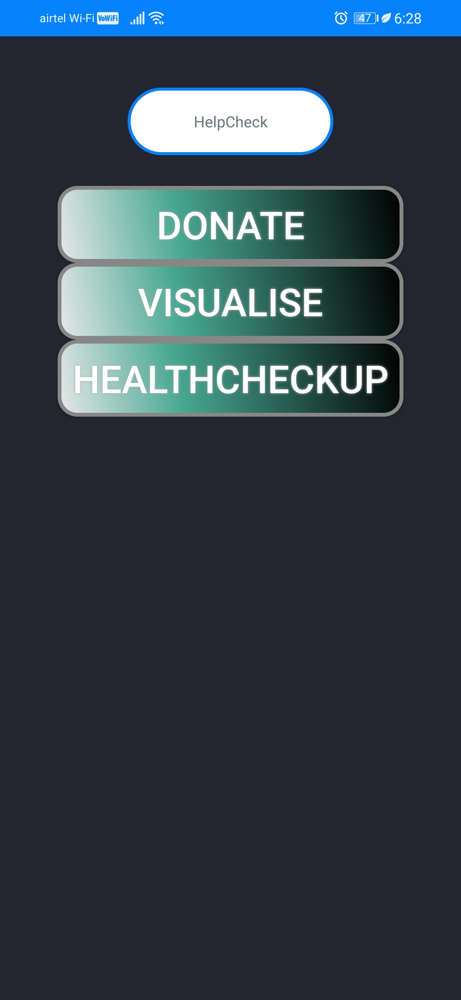

# Corona(Covid19)

CORONA Android Application will help you to know the latest Corona cases in the world as well as in countries. This app contains news features which shows all the current news about Corona also the helpline numbers. It also contains statistics in the form of a graph. You also can donate using this app. You also can check if you have corona or not. This app's purpose is to make people aware of this Coronavirus so that people can take the necessary precautions.

You can download the application from given link ( <a href="https://drive.google.com/file/d/166ruGOu5bllMwB5Q9naqrx4gMA79JivB/view?usp=sharing">Download APK</a> )  

It fetchs live data from <a href="https://corona.lmao.ninja/">https://corona.lmao.ninja/</a>.

 

This application have various Section.

1. World Report

-> Where you will see list of countries data along with there Total Cases, Total Recovered Cases and Total Deaths.
 
-> All the country list is been sorted according to there Total Cases.

2. Country Report

-> It has one spinner through which you can search country name to get there respective detail.

3.  News

-> It shows all the latest news about corona.

4. Donate

->You can donate the amount to help government.

5.Visualise

->You can see the graph related to corona.

6.HealthCheck

->You can check your health,answering some questions.

  

Hardware and Software Requirements
1. Android Studio(latest version)
2. chrome Browser

Process Flow

1.Install the android studio and create new project.

2.start the main activity and select all the necessary options.

3.Create the gui and call the api to get all the data in the page.

4.Check all the dependencies and internet access.

5.Build the app and test.

Data Flow Diagram

#Licence

Copyright 2020 Vikas Maurya

Licensed under the Apache License, Version 2.0 (the "License");
you may not use this file except in compliance with the License.
You may obtain a copy of the License at

   http://www.apache.org/licenses/LICENSE-2.0

Unless required by applicable law or agreed to in writing, software
distributed under the License is distributed on an "AS IS" BASIS,
WITHOUT WARRANTIES OR CONDITIONS OF ANY KIND, either express or implied.
See the License for the specific language governing permissions and
limitations under the License.
